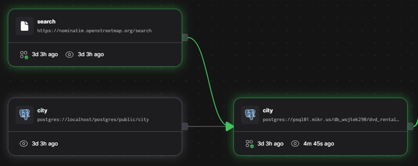

<h1 style="text-align:center">My Data Engineer Portfolio</h1>

Hi, this is a repository that contains a few projects with my Data Engineer skills. \
My basic tech stack are **<a href="https://www.python.org/">Python</a>, <a href="https://www.postgresql.org/">PostgreSQL</a>, <a href="https://www.mongodb.com/">mongoDB</a>, <a href="https://www.prefect.io/">Prefect Cloud</a>**.
Basic dataset was PostgreSQL: <a href="https://neon.com/postgresql/postgresql-getting-started/postgresql-sample-database"> dvd_rental.tar </a>.


## Project List
| id | name                   | description                                                                                         | status | path                                                                                                                        |
|----|------------------------|-----------------------------------------------------------------------------------------------------|--------|-----------------------------------------------------------------------------------------------------------------------------|
| 1. | Data Migration         | Data migration from localhost to the instance on VPS.                                                   | ✅      | [/01_data_migration](https://github.com/Cracowiatschek/DataEngineerPortfolio/tree/master/01_data_migration)                 |
| 2. | Data Mixing            | Daily data transformation, obtaining different results every day while maintaining data consistency. | 💤     |                                                                                                                             |
| 3. | Golden Record          | Daily data migration from PostgreSQL to MongoDB and create Golden Record for every customer.        | ✅️     | [/03_golden_record](https://github.com/Cracowiatschek/DataEngineerPortfolio/tree/master/03_golden_record)                   |
| 4. | Categorize pipeline    | Pipeline to customer categorize in Golden Record.                                                   | 🛠️    |                                                                                                                             |
| 5. | Get data from the internet | Daily, get data from the API and store it in PostgreSQL.                                           | ✅      | [/05_get_data_from_internet](https://github.com/Cracowiatschek/DataEngineerPortfolio/tree/master/05_get_data_from_internet) |

## 1. Data Migration
This is initializing all my projects. My target was to have access to a sample dataset from any device for training for my wife and me. \
When I was creating structures, I came up with an idea for this portfolio. \
So, in this project, I created a copy of the schema dvd_rental and migrated data from localhost to VPS with Prefect Cloud.  
Data was copied table by table; if I got an error, the process was interrupted.

**Tech stack:**
* Python 
* PostgreSQL 
* Prefect Cloud 
### 1.1. Create a similar data schema in a VPS PostgreSQL instance.

### 1.2. Create a load data config file.
This is JSON with a list of tables. 

#### **Structure:** 
* **name**: table name,
* **schema_in**: schema from localhost,
* **schema_out**: schema from VPS,
* **depends_on**: list of table dependencies needed to create a migration queue.

### 1.3. Create migration flow.
#### **Flow has three steps:**
1. load configuration file,
2. Create migration queue,
3. table-by-table migration according to the queue.

#### 1.3.1. Load configuration file *@task*
The file was loaded from JSON as a list of dictionaries.

#### 1.3.2. Create migration queue *@task*
A queue was created from the configuration list so that tables without dependencies were migrated first, and then, as dependencies were added, the remaining tables were migrated.

#### 1.3.3. Migration *@task*
The migration consisted of downloading the table contents from localhost and then inserting the contents according to the list of columns retrieved from the metadata in batch form.
In case of an error, the table migration was interrupted, and a rollback was performed for the given table.

#### 1.3.4. Run Flow with Prefect *@flow*

## 3. Golden Record
For this project, I created three materialized views to prepare data (```customers_mv```➡️simple customer attributes without joins, ```customer_aggr_mv```➡️aggregations for every customer, ```last_rentals_mv```➡️last ten rentals for every customer). \
The project has two steps:
1. configuration (export all files/variables to Prefect Cloud) 
2. Refresh materialized views
3. Create (_upsert_) every customer as a Golden Record to NoSQL DB (MongoDB) 

On the platform Prefect Cloud, I set a rule that if the flow with refresh views has a Failed or Crashed status, the next flow with Golden Record upsert is waiting for manual restart of the earlier process.


**Tech stack:**
* Python 
* PostgreSQL 
* MongoDB 
* Prefect Cloud 
* GitHub 

**Materialized views:** 
#### ```customer_mv``` 

| id  | column name         | dtype       | description                                      | source                                |
|-----|---------------------|-------------|--------------------------------------------------|---------------------------------------|
| 1.  | customer_id         | int         | customer id                                      | ```dvd_rental.customer.customer_id``` |
| 2.  | first_name          | varchar(45) | customer first name                              | ```dvd_rental.customer.first_name```  |
| 3.  | last_name           | varchar(45) | customer last name                               | ```dvd_rental.customer.last_name```   |
| 4.  | is_active           | bool        | is active indicator                              | ```dvd_rental.customer.activebool```  |
| 5.  | address             | varchar(50) | home number and street                           | ```dvd_rental.address.address```      |
| 6.  | district            | varchar(20) | district                                         | ```dvd_rental.address.district```     |
| 7.  | city                | varchar(50) | city                                             | ```dvd_rental.city.city```            |
| 8.  | longitude           | float       | longitude of city center                         | ```dvd_rental.city.longitude```       |
| 9.  | latitude            | float       | latitude of city center                          | ```dvd_rental.city.latitude```        |
| 10. | country             | varchar(50) | country                                          | ```dvd_rental.country.country```      |
| 11. | full_address        | text        | full address = address, city, country (district) |                                       |
| 12. | phone               | varchar(20) | phone number                                     | ```dvd_rental.address.phone```        |
| 13. | email               | varchar(50) | email                                            | ```dvd_rental.customer.email```       |
| 14. | postal_code         | varchar(10) | postal code                                      | ```dvd_rental.address.postal_code```  |
| 15. | assistant_name      | varchar(45) | shop assistant first name                        | ```dvd_rental.staff.first_name```     |
| 16. | assistant_last_name | varchar(45) | shop assistant last name                         | ```dvd_rental.staff.last_name```      |
| 17. | assistant_email     | varchar(45) | shop assistant email                             | ```dvd_rental.staff.email```          |
| 18. | last_refresh_date   | timestamp   | timestamp of view refresh                        |                                       |

#### ```customer_aggr_mv```
| id  | column name                 | dtype     | description                                       | source                                                                          |
|-----|-----------------------------|-----------|---------------------------------------------------|---------------------------------------------------------------------------------|
| 1.  | customer_id                 | int       | customer id                                       | ```dvd_rental.customer.customer_id```                                           |
| 2.  | overdue_score               | int       | percentage of late returns                        | ```dvd_rental.rental.return_date-rental_date>dvd_rental.film.rental_duration``` |
| 3.  | most_recent_store           | text      | store where customer has the most rentals         |                                                                                 |
| 4.  | last_rental_film            | text      | last rental film title                            |                                                                                 |
| 5.  | last_rental_date            | timestamp | last rental date                                  |                                                                                 |
| 6.  | lifetime_value              | numeric   | sum of all rentals amount                         |                                                                                 |
| 7.  | total_rental_count          | int       | count of all rentals                              |                                                                                 |
| 8.  | average_rental_duration     | numeric   | average from all rentals durations                |                                                                                 |
| 9.  | average_rental_payment      | numeric   | average from all rentals payments                 |                                                                                 |
| 10. | average_film_duration       | numeric   | average from all rentals film duration            |                                                                                 |
| 11. | last_year_rental_count      | int       | count of rentals from last year                   |                                                                                 |
| 12. | last_year_payments_sum      | numeric   | sum of rentals amount from last year              |                                                                                 |
| 13. | last_payment                | numeric   | amount of last payment                            |                                                                                 |
| 14. | most_recent_category        | text      | most recent film category from all rentals        |                                                                                 |
| 15. | second_most_recent_category | text      | second most recent film category from all rentals |                                                                                 |
| 16. | third_most_recent_category  | text      | third most recent film category from all rentals  |                                                                                 |
| 17. | most_recent_film_title      | text      | most recent film title from all rentals           |                                                                                 |
| 18. | most_recent_film_actor      | text      | most recent film actor from all rentals           |                                                                                 |
| 19. | most_recent_film_year       | text      | most recent film year from all rentals            |                                                                                 |
| 20. | last_refresh_date           | timestamp | timestamp of view refresh                         |                                                                                 |

#### ```last_rentals_mv```
| id  | column name        | dtype        | description                                                                         | source                                                                                                                                                  |
|-----|--------------------|--------------|-------------------------------------------------------------------------------------|---------------------------------------------------------------------------------------------------------------------------------------------------------|
| 1.  | rental_id          | int          | rental id                                                                           | ```dvd_rental.rental.rental_id```                                                                                                                       |
| 2.  | customer_id        | int          | customer id                                                                         | ```dvd_rental.rental.customer_id```                                                                                                                     |
| 3.  | title              | varchar(255) | film title                                                                          | ```dvd_rental.film.title```                                                                                                                             |
| 4.  | category           | varchar(25)  | film category                                                                       | ```dvd_rental.category.name```                                                                                                                          |
| 5.  | amount             | numeric      | payment                                                                             | ```coalesce(dvd_rental.rental.amount, dvd_rental.film.replacement_cost)```                                                                              |
| 6.  | rental_date        | timestamp    | rental date                                                                         | ```dvd_rental.rental.rental_date```                                                                                                                     |
| 7.  | return_date        | timestamp    | return date                                                                         | ```dvd_rental.rental.return_date```                                                                                                                     |
| 8.  | rental_duration    | int          | rental duration in days                                                             | ```coalesce(dvd_rental.rental.return_date, now())-dvd_rental.rental.rental_date```                                                                      |
| 9.  | is_completed       | bool         | true if film was returned                                                           | ```case when dvd_rental.rental.return_date is not null then true else false end```                                                                      |
| 10. | is_overdue         | bool         | true if return date (or now if return date is empty) was after film rental duration | ``` case when coalesce(dvd_rental.rental.return_date, now())-dvd_rental.rental.rental_date > dvd_rental.film.rental_duration then true else false end``` |
| 11. | store              | text         | store where film was rental                                                         | ```address, city, country (district)```                                                                                                                 |
| 12. | last_refresh_date  | timestamp    | timestamp of view refresh                                                           |                                                                                                                                                         |


## 3.1. Refresh materialized views  *@flow*
This flow has a few tasks: first, to make a queue from Prefect Cloud Block, second, to get the last refresh date for all views, and third, to refresh the view.
If not all views are refreshed, flow try rerun 3 times.

### 3.1.1 Make queue from JsonConfig block *@task*
At flow is load config from cloud, object is JSON with the structure of an array of:
```json
[
  {
    "schema": "v_dvd_rental",
    "materialized_view": "customers_mv",
    "sources": [
      {
        "schema": "dvd_rental",
        "table": "customer"
      }, {
        "schema": "dvd_rental",
        "table": "address"
      }, {
        "schema": "dvd_rental",
        "table": "city"
      }, {
        "schema": "dvd_rental",
        "table": "country"
      }, {
        "schema": "dvd_rental",
        "table": "store"
      }, {
        "schema": "dvd_rental",
        "table": "staff"
      }
    ]
  }
]
```
And in the next step, the object is loaded and makes a queue of ```namedtuple("MaterializedView", ["schema", "view_name", "sources"])```, where sources is a list of ```namedtuple("Source", ["schema", "table_name"])```.
Sources are important to materialize Assets in Prefect Cloud, thanks to this, I have a full overview of overload situations on the cloud graph.

### 3.1.2. While loop with tasks:

#### 3.1.2.1. Check last refreshed data *@task*
Task: get timestamp and save it in a dict with two lists of timestamps ``` before ``` and ``` after ```, at this time, the timestamp goes to the ' before list.

#### 3.1.2.2. Try to refresh the view *@task*
Task: Try to refresh the materialized view from the queue.

#### 3.1.2.3. Check last refreshed data *@task*
Like first checking, but at this time, the timestamp goes to the after list.

#### 3.1.2.4. Check refreshed timestamps *@task*
If some timestamps are in both lists, raise error NotAllViewsRefreshed, and retry flow (limit=3 times with 120 seconds delay).

### 3.1.3. Deploy.
Flow is deployed in Prefect Cloud with a hobby workpool, and code is getting from the GitHub repository.

## 3.2. Upsert Golden Record *@flow*
This flow has a few tasks: first, to get data from PostgreSQL (from refreshed materialized views), second, to validate data with the defined data model in Pydantic, and third, to upsert the customer to MongoDB Golden Record.
Records are processed in batches, packing 1000 customers and upserts as bulk write operations. 

### Golden Record structure

```python
from datetime import datetime
from typing import List, Optional
from pydantic import BaseModel, confloat, EmailStr, conint

class GoldenRental(BaseModel):
    _id = int
    title: str
    category: str
    amount: confloat(ge=0)
    rental_date: datetime
    return_date: Optional[datetime]
    rental_duration: conint(ge=0)
    is_completed: bool
    is_overdue: bool
    store: str


class Source(BaseModel):
    _id: int
    sub_id: Optional[List[int]]
    path: str
    fields: List[str]
    last_refreshed: datetime


class GoldenCustomer(BaseModel):
    id: int
    first_name: str
    last_name: str
    is_active: bool
    full_address: str
    address: str
    district: Optional[str]
    city: str
    country: str
    latitude: confloat(ge=-90, le=90) = 0.0
    longitude: confloat(ge=-180, le=180) = 0.0
    phone: Optional[str]
    email: Optional[EmailStr]
    postal_code: Optional[str]
    assistant_name: str
    assistant_email: str
    overdue_score: conint(ge=0, le=100)
    most_recent_store: Optional[str]
    last_rental_film: Optional[str]
    last_rental_date: Optional[datetime]
    lifetime_value: confloat(ge=0) = 0.00
    total_rental_count: conint(ge=0) = 0
    average_rental_duration: confloat(ge=0, le=500)  = 0.00
    average_rental_payment: confloat(ge=0) = 0.00
    average_film_duration: confloat(ge=0) = 0.00
    last_year_rental_count: conint(ge=0) = 0
    last_year_payments_sum: confloat(ge=0) = 0.00
    last_payment: confloat(ge=0) = 0.00
    most_recent_film_category: Optional[str]
    second_most_recent_film_category: Optional[str]
    third_most_recent_film_category: Optional[str]
    most_recent_film_title: Optional[str]
    most_recent_film_actor: Optional[str]
    most_recent_film_year: Optional[str]
    last_ten_rentals: Optional[List[GoldenRental]]
    last_consolidation_date: datetime
    sources: List[Source]
```

### 3.2.1. Get data *@task*
Create one cursor and get records in one Golden Query stored as a String in Prefect Cloud, data is fetched from many tasks, and a yield function.

### 3.2.2. Make Golden Records *@task*
Rows are checked row by row in the defined data model. If the row is not valid, then pass it; if everything is okay, the row is transformed to a Golden Record object and appended to the list, which is returned.

### 3.2.3. Materialize Records *@task*
This task upserts many operations in bulk write to MongoDB.

### 3.2.4. Deploy.
Flow is deployed in Prefect Cloud with a hobby workpool, and code is getting from the GitHub repository.

# 5. Get data from the internet
In my ```dvd_rental``` schema, I've ```city``` table, so I add two columns ```longitude numeric, latitude numeric``` and I enrich data about this information by OSM API Nominatim (``` from geopy.geocoders import Nominatim```), where I get coordinates of the city center and send to PostgreSQL.

**Tech stack:**
* Python 
* PostgreSQL 
* Prefect Cloud 
* GitHub 

## 5.1. Get cities without coordinates *@task*
From PostgreSQL get data with query (stored in Prefect Cloud), and return list of ```namedtuple("City", ["id", "city", "country", "longitude", "latitude"])```.
Longitude and Latitude are placeholders with a None value; City and Country need to search for coordinates.



## 5.2. Make queue *@task*
Change the list of cities to queue to better organise the next step.

## 5.3. Get coordinates *@task*
As input is a queue of City, the task has a while loop, iterate objects, and send API request by ```geopy.geocoders` library with one-second delay between requests (protection against IP blocking and timeouts).
If a request returns a location, a City object with longitude and latitude is appended to the list and returned.

## 5.4. Save coordinates *@task*
In cursor, I create a TMP table with a query from Cloud, and use ```COPY``` statement to insert data into the table, if the table has data, update the target object by query from Cloud. If something goes wrong, process rollback changes.

## 5.5. Deploy.
Flow is deployed in Prefect Cloud with a hobby workpool, and code is getting from the GitHub repository.
